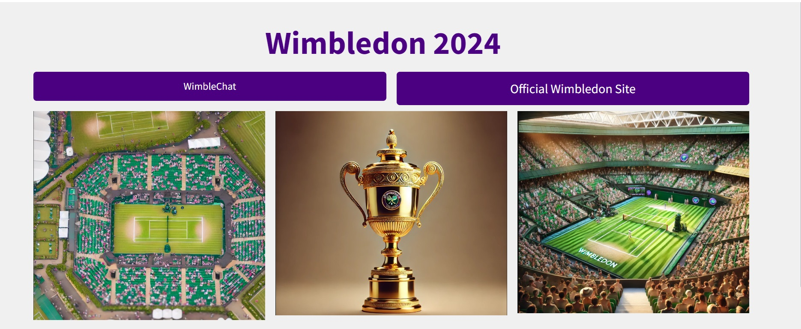
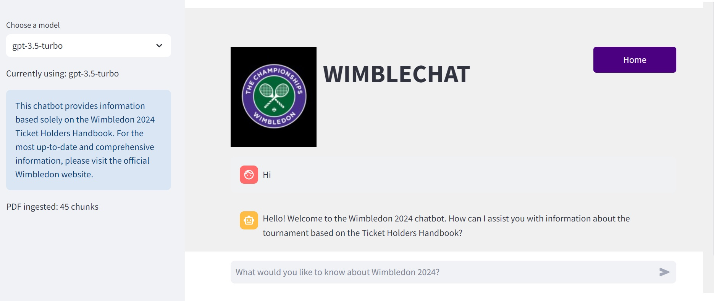
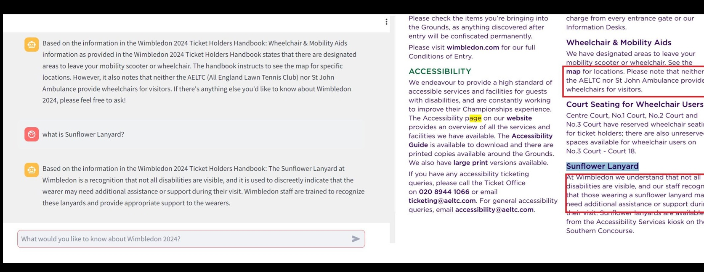
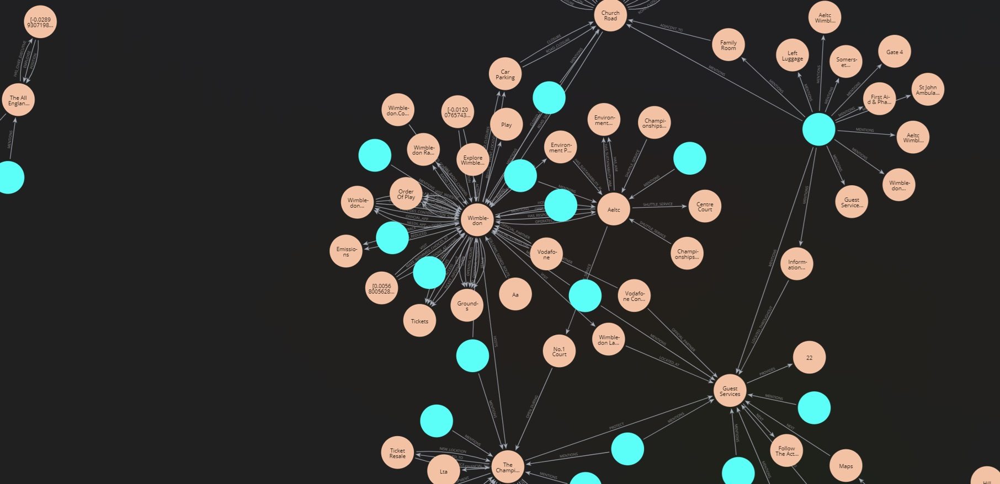

# WimbleChat

## Application Overview

The **Wimblechat**(Wimbledon 2024 Chatbot) is an AI-powered application that provides information and answers questions about the Wimbledon tennis tournament based on the Ticket Holders Handbook 2024.

## Functionality

- Offers real-time responses to user queries about Wimbledon 2024 - Ticket Holders Handbook 2024
- Provides information on timings, tickets, food, services, etc.
- Utilizes natural language processing for user-friendly interactions

## User Guide

1. Access the application via web browser at: [Wimbledon Chatbot](http://wimbledonchatbot.uksouth.azurecontainer.io:8501)
2. Click on **'WimbleChat'** to get into the chat interface. It might take a **minute** to load the first time; **try reloading** or **clicking on Home**(The time to load the chat is a limitation).
3. Type questions or prompts in the chat interface. The questions need to be very basic. It sometimes doesn't recognise the question which needs improvment.
4. Receive instant responses about Wimbledon-related information - Ticket Holders Handbook 2024.
5. You could toggle between both **models(gpt-3.5-turbo,gpt-4-turbo-preview)** and compare the responses too.

## Tech Stack

- **Frontend:** Streamlit (Python-based web application framework)
- **Backend:** Python
- **AI/ML:** OpenAI's language models via the OpenAI API
- **Database:** Neo4j graph database
- **Orchestrator:** Langchain
- **Containerization:** Docker
- **Cloud Platform:** Microsoft Azure (Azure Container Instances)
- **Version Control:** Git

## Advantages

- 24/7 availability for Wimbledon-related queries - Ticket Holders Handbook 2024
- Scalable architecture to handle multiple users
- Easy maintenance and updates through containerization
- Utilizes advanced AI for natural language understanding and generation

## Potential Improvements

- Implement HTTPS for secure communication
- Add multi-language support
- Integrate real-time match updates and live scores
- Implement user authentication for personalized experiences
- Enhance the UI with Wimbledon branding and tennis-themed elements

## Advantages of RAG with Graphs

- **Enhanced Contextual Understanding:** Graph databases like Neo4j excel at capturing and querying complex relationships, providing a richer context for the generative model.
- **Scalability:** Neo4j can handle large volumes of interconnected data, making it suitable for applications requiring extensive knowledge bases.
- **Improved Accuracy:** The use of OpenAI embeddings ensures that the most semantically relevant information is retrieved, leading to more accurate and relevant responses.
- **Flexibility:** LangChain's framework allows for easy customization and integration of various data sources and processing steps, making it adaptable to different use cases.

## Deployment Process

1. Application containerization using Docker
2. Creation of Azure Container Registry (ACR) for image storage
3. Pushing the Docker image to ACR
4. Setting up Azure Key Vault for secure storage of sensitive information
5. Creating a managed identity for secure access to Azure resources
6. Deploying the container to Azure Container Instances (ACI)
7. Configuring environment variables in ACI using Key Vault references

## Benefits of Deployment Method

- **Scalability:** Easy to scale up or down based on demand
- **Cost-effective:** Pay only for the resources you use
- **Simplified management:** No need to manage underlying infrastructure
- **Quick deployment:** Rapid updates and rollbacks possible
- **Security:** Utilizes Azure's robust security features and Key Vault for secret management
- **Isolation:** Containerization ensures consistency across different environments

## Conclusion

Using Neo4j in conjunction with LangChain and OpenAI embeddings enhances the traditional RAG approach by leveraging the strengths of graph databases in managing complex relationships and providing rich contextual information. This leads to more accurate, contextually relevant, and high-quality responses from generative models.
